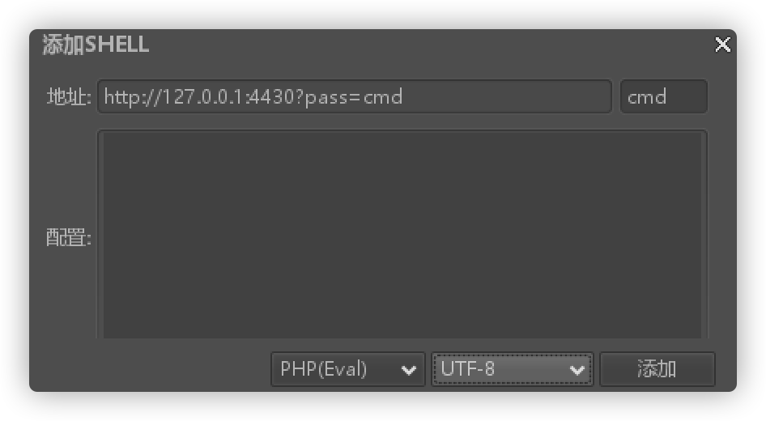

# README

Ruijie Networks RCE漏洞检测工具，为方便渗透测试使用，可以批量检测，也会生成历史记录。同时也为防止他人恶意使用，可自定义GET参数密码，该密码由sha256加密，难以破解。

## 免责声明
由于传播、利用此文所提供的信息而造成的任何直接或者间接的后果及损失，均由使用者本人负责，作者不为此承担任何责任。

## 参数
```bash
  -f string
    	导入.txt文件批量扫描
  -n string
    	自定义POST木马密码，默认cmd
  -p string
    	自定义GET密码验证，默认为cmd
  -u string
    	目标URL
```

## 使用
检测到漏洞后生成随机数.php文件执行命令，也可以上菜刀。



### 普通使用
GET密码：cmd
POST密码：cmd
```bash
./RuijieRCE -u http://127.0.0.1:4430
```

### 设置密码
-n参数为POST密码，-p参数为GET密码
这两个参数缺省时均为cmd，可以只设置一个或者同时都设置
```bash
./RuijieRCE -u http://127.0.0.1:4430 -n asd -p zxc
```

### 批量测试
批量测试时可以
```bash
./RuijieRCE -f url.txt
```
